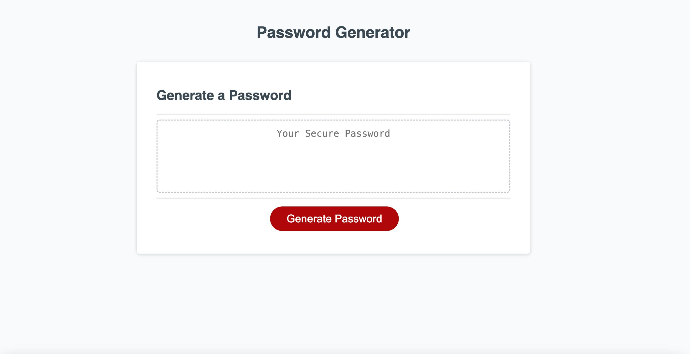

# Password-Generator

## Description

The Password-Generator website is an easy form comprising a field where the password will be generated and a button. Once the button is pressed, an option for the type of password will pop up. After answering a series of questions, a password will be generated and displayed in the password field. The design is mobile-friendly and should function seamlessly on different devices.

Link to the deployed project:
https://unicorn453.github.io/Password-Generator/

When opened the page should look like this:

## Installation

N/A

## Usage

In the Password-Generator project, a JavaScript file is used to generate secure passwords. The code includes an array of different characters such as upper case, lower case, numeric and special characters. When the user presses the button, a function is triggered that prompts the user to choose from a series of options. The user must choose at least one option. Once the user has made a choice, a password containing the selected characters will appear in the "Your Secure Password" field. The password will be at least 8 characters long and no more than 148 characters long. If the user does not make a choice, the options will continue to appear until one is selected. If the user wants to regenerate the password, they can simply press the button again and go through the options or refresh the page.

## Credits

The development of the code process involved leveraging ChatGPT.
Other resources:
I used a previously written README file as a template to create this README.
‌

## License

Please refer to the LICENSE in the repo.
